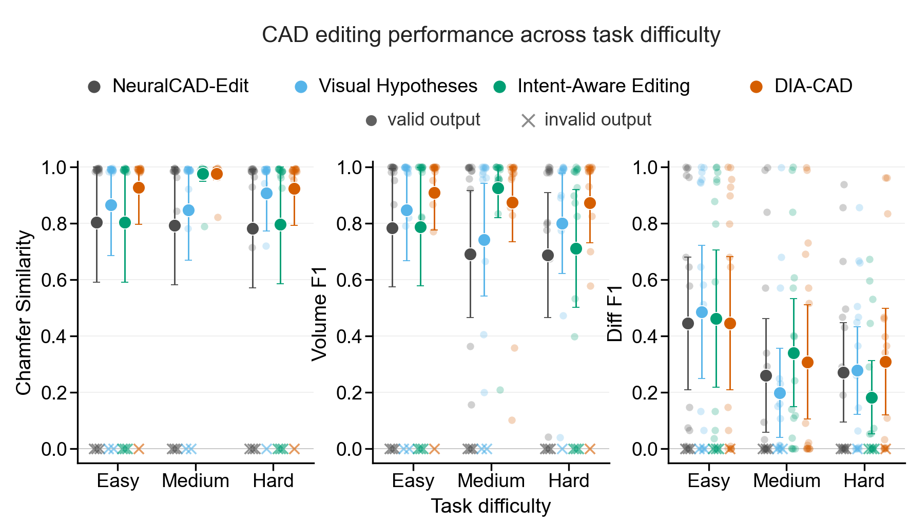
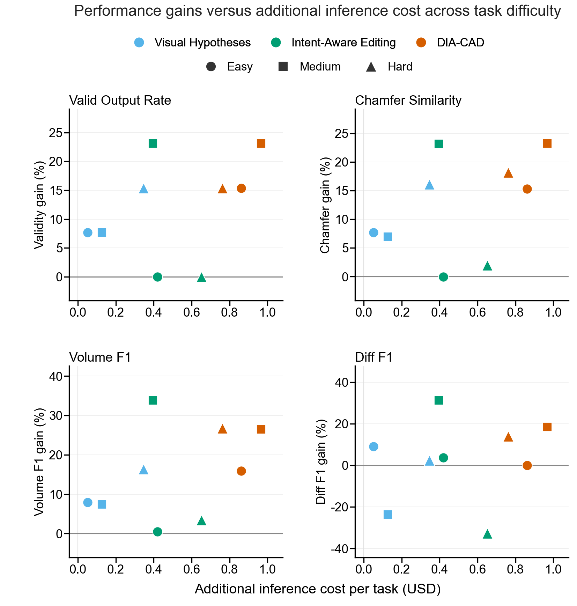
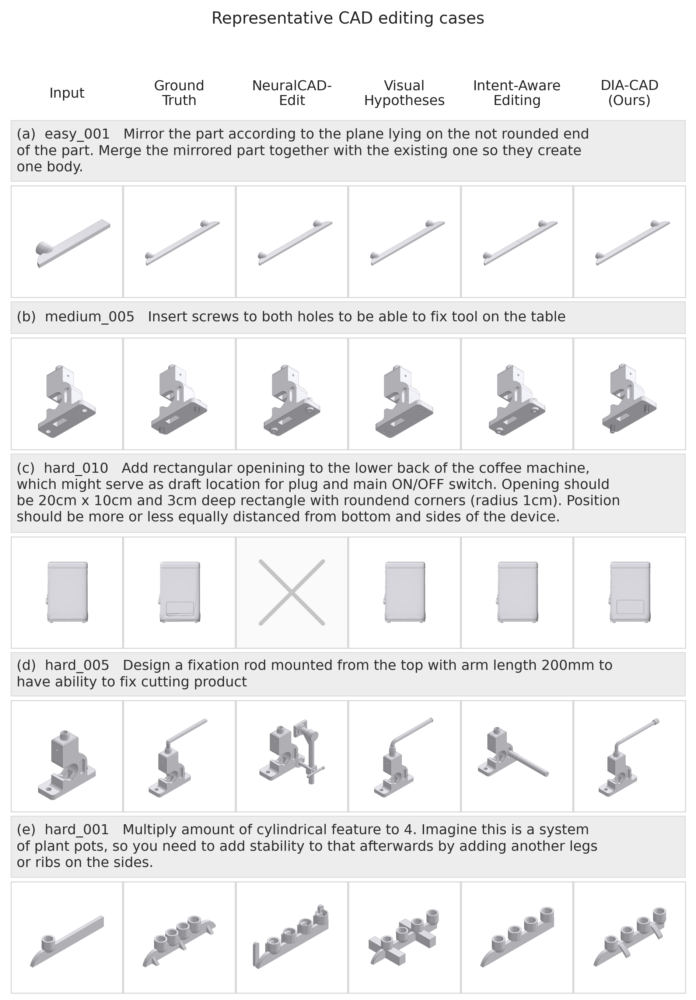

# DIA-CAD

Intent-aware CAD editing: predicted visual targets, explicit design intent, and a state-driven CadQuery harness.

This repository contains **the DIA-CAD implementation** and **48-task results** for all four paper conditions. It does **not** include the other three methods’ code, the competition STEP files, or predicted meshes.

## What DIA-CAD does

Given `input.step` and an edit `description.txt`, the pipeline:

1. Builds input context (orientation and CAD views) — prompts `s0_*`
2. Predicts post-edit visual hypotheses — prompts `s1_*`
3. Formulates structured design intent — prompts `s2_*`
4. Edits CAD with a state-driven harness, executes CadQuery, and checks the result — `src/harness/pipeline/edit_harness/`, prompts `s3_*` / `s4_*`

Entry point: `PYTHONPATH=src python -m harness.pipeline`. Settings live in `config.yaml`; prompt templates in `workspace/prompts/cad_edit/`.

## Experimental conditions

All four rows used the same 48 official neuralCAD-Edit tasks (16 Easy / 16 Medium / 16 Hard) with `gpt-5.6-sol` (ChatGPT OAuth, reasoning medium). Only DIA-CAD is implemented here.

| Paper name | Visual target images | Structured design intent | Intent-aware harness |
|---|---|---|---|
| NeuralCAD-Edit | no | no | no |
| Visual Hypotheses | yes | no | no |
| Intent-Aware Editing | no | yes | yes |
| DIA-CAD | yes | yes | yes |

- NeuralCAD-Edit: official CadQuery visual-update loop from the edit description.
- Visual Hypotheses: predicted post-edit images as visual guidance, then that same loop; no structured intent.
- Intent-Aware Editing: explicit intent and the DIA-CAD harness, without predicted target images.
- DIA-CAD: predicted targets, structured intent, and the intent-aware harness.

## Reported results

Geometric metrics: Chamfer similarity (normalized), Volume F1, Diff F1. **n=48**; missing or unreadable Pred STL scores **0**. This repo cannot recompute those metrics (Start/GT/Pred meshes are not shipped). Cite the CSVs in `data/`.

Estimated inference cost (not a vendor invoice):

```
USD = input_tokens / 1e6 × 5 + output_tokens / 1e6 × 30
```

That is **$5 per million input tokens** and **$30 per million output tokens**. Missing usage is $0; the denominator is all 16/48 tasks. Visual Hypotheses cost uses CAD-loop tokens only.

Overall (n=48):

| Condition | Valid Pred | Chamfer | Volume F1 | Diff F1 |
|---|---|---|---|---|
| NeuralCAD-Edit | 39/48 | 0.793 | 0.721 | 0.326 |
| Visual Hypotheses | 43/48 | 0.874 | 0.796 | 0.321 |
| Intent-Aware Editing | 42/48 | 0.859 | 0.808 | 0.328 |
| DIA-CAD | 46/48 | 0.942 | 0.885 | 0.354 |

Per-task files (`data/quality_per_case/`, `data/usage/`) still use older prefixes: `Visual Target Only` / `visual_target_only` = Visual Hypotheses; `Harness Only` / `harness_only` = Intent-Aware Editing. `data/result_models_index.csv` records which cases had Pred STEP/STL.

**CAD editing performance across task difficulty**



**Performance gains versus additional inference cost across task difficulty**



**Representative CAD editing cases**



## Setup

Python 3.10+, then:

```bash
python -m pip install -r requirements.txt
```

Create a local `.env` (do not commit it or OAuth files):

```dotenv
DEFAULT_PROVIDER=chatgpt_oauth
CHATGPT_AUTH_PATH=
CHATGPT_MODEL=gpt-5.6-sol
CHATGPT_REASONING_EFFORT=medium
```

For an OpenAI-compatible API instead:

```dotenv
DEFAULT_PROVIDER=openai_compat
OPENAI_API_KEY=
OPENAI_BASE_URL=
MODEL_ID=gpt-5.6
```

## Run DIA-CAD

Place competition cases under `input/` (not in this repository):

```text
input/
├── easy_001/
│   ├── input.step
│   └── description.txt
├── medium_001/
└── hard_001/
```

List cases:

```bash
PYTHONPATH=src python -m harness.pipeline --batch --inputs-dir input --list-cases
```

One case:

```bash
PYTHONPATH=src python -m harness.pipeline \
  --input input/easy_001/input.step \
  --description input/easy_001/description.txt \
  --run-id easy_001
```

Batch:

```bash
PYTHONPATH=src python -m harness.pipeline --batch --inputs-dir input --run-id evaluation
```

Offline wiring check (no live model or image APIs):

```bash
PYTHONPATH=src python -m harness.pipeline \
  --input input/easy_001/input.step \
  --description input/easy_001/description.txt \
  --run-id offline_test \
  --stub --stub-media
```

Default artifacts: `workspace/artifacts/<run-id>/`

```text
01_input/          Copied input STEP and description
02_views/          Input model renders
03_target_render/  Target reference renders
04_structure/      Structured edit data
05_code/           Generated CadQuery code and feature probe
06_output/         output.step and output.stl
07_result_verify/  Output renders and verification files
08_harness/        Iteration history and final report
manifest.json
usage.csv
```

`config.yaml` is the DIA-CAD runtime file (not experiment scores). It sets:

- **provider / network** — ChatGPT OAuth vs OpenAI-compatible API, model (`gpt-5.6-sol`), reasoning effort, proxy
- **agent / context / tools** — iteration limits, message budget, HTTP/bash caps
- **pipeline** — input/artifact paths, view size, S1/S3/result-QC retries, whether to use the state-driven edit harness
- **feature_probe** — OCP facts plus optional Palmetto (`PALMETTO_ENGINE_PATH` or `pipeline.feature_probe.palmetto_engine_path`)
- **harness** — edit rounds, code repairs, MLLM/view search limits, and geometric QC gates (silhouette IoU, preservation, no-op detection)

Prompt text is not in this file; it stays under `workspace/prompts/cad_edit/`.

## Layout

```
config.yaml              Pipeline settings
src/harness/             DIA-CAD implementation
workspace/prompts/       Stage prompts
data/                    48-task scores and token usage (four conditions)
images/                  Paper figures
requirements.txt
LICENSE
```

## License

MIT. See `LICENSE`.
